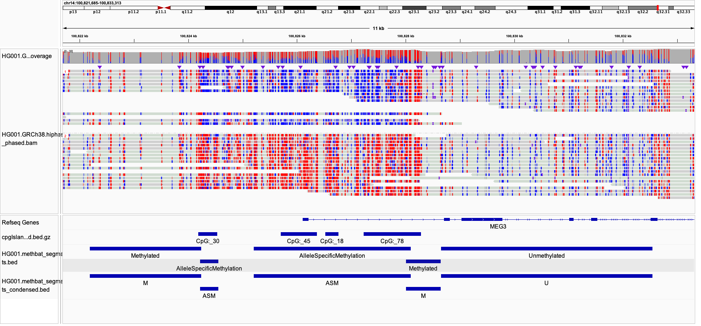

# Method Summary
## Segmentation
The MethBat segmentation algorithm is based on the Circular Binary Segmentation (CBS) described in [Circular binary segmentation for the analysis of array-based DNA copy number data](https://doi.org/10.1093/biostatistics/kxh008).
This approach will recursively split a sequence of values into three smaller ones by finding optimal segmentation points for regions above and below the mean.
When a candidate split is identified, it will use statistics to determine whether to keep the segment as one or split into subunits for recursion.
In MethBat, this statistic is based on the Z-score measure between two populations, which are the regions inside and outside the split.
This relies on knowing the population standard deviation beforehand.
Since we often do not know this value beforehand, we use an iterative form of CBS that converges on the standard deviation by repeatedly running CBS with increasingly accurate standard deviation values.

In MethBat, segmentation is performed on two sequences: 1) combined methylation fraction (e.g., methylated count / total count, range [0.0, 1.0]) for detecting Methylated/Unmethylated regions and 2) haplotype delta methylation fraction (e.g., haplotype 2 methylation fraction - haplotype 1 methylation fraction, range [-1.0, 1.0]) for detecting Allele Specific Methylation (ASM).
Since these iterative CBS algorithms are run separately, it is possible that some of the ASM segments will overlap one or more of the Methylated/Unmethylated segments.
In our experience, these overlaps are usually small and near the transition points of segmentation.
The CBS algorithm provides initial segmentation sets and then those are labeled according to user-provided parameters.
Adjacent segments with the same level will be merged in the output BED segmentation file (this can happen when the algorithm detects different level of severity of the feature, e.g. combined methylation segments averaging 0.9 and 0.98 will both be labeled as "Methylated").

### Segmentation Parameters
Several user parameters control the segmentation behavior, which are described below:
* `--target-confidence` - Confidence metric (e.g. 0.99 = 99%) which is converted to a Z-score for comparing the populations. Higher values correspond to higher Z-scores (see `--min-abs-zscore`).
* `--min-abs-zscore` - Z-score metric used to determine if a segment should be split or not. Higher values increases the threshold required to split a segment, leading to fewer overall segments in the output.
* `--min-cpgs` - Controls the minimum size of a segment in terms of number of CpGs. Smaller values may lead to over-segmentation. Similarly, higher values may lead to under-segmentation.
* `--max-gap` - Controls the maximum allowed basepairs between consecutive CpGs. If the gap exceeds this threshold, then the region will be split into separate segments.

There are also controls for how the final segments are labeled, which are described below:
* `--min-asm-abs-delta-mean` - Controls the minimum allowed difference between haplotype methylation fractions to label a segment as Allele Specific Methylation (ASM). Lower values may lead to an over-representation of ASM segments, whereas higher values may lead to an under-representation of ASM. Mathematically, if haplotype 1 has a methylation fraction of 0.8 and haplotype 2 has a methylation fraction of 0.2, then the delta mean (hap2-hap1) is -0.6. If this parameter is left as the default of 0.5, MethBat would label the corresponding segment as ASM because |-0.6| >= 0.5.
* `--max-unmethylated-combined` - Controls the maximum combined methylation fraction to label a segment as Unmethylated. Lowering this value may lead to fewer Unmethylated segments.
* `--min-methylated-combined` - Controls the minimum combined methylation fraction to label a segment as Methylated. Increasing this value may lead to fewer Methylated segments.
* `--condense-bed-labels` - Provides condensed labeling of the regions in the output BED file. This occasionally impacts the visual representation in IGV.

### Segmentation example
The following image shows an example of the segmentation in a region of HG001 around MEG3, a gene with known imprinting (e.g. ASM) such that typically only the maternal copy is expressed.
The top tracks show the reads grouped by haplotype and colored by methylation status (red = methylated, blue = unmethylated).
The bottom tracks show the RefSeq genes, known CpG islands, and the segmentation labels from MethBat (both full and label condensed).

